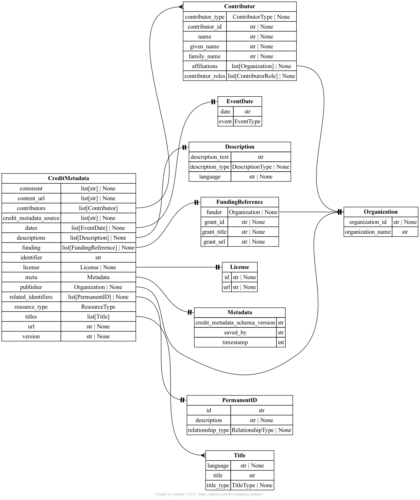

[](https://codecov.io/gh/kbase/credit_engine)
[](https://www.codacy.com/gh/kbase/credit_engine/dashboard?utm_source=github.com&amp;utm_medium=referral&amp;utm_content=kbase/credit_engine&amp;utm_campaign=Badge_Grade)

# Dataset Citation Metadata

This repo holds the schema and associated scripts used by the Dataset Citation Metadata project.

The Dataset Citation Metadata is a project aimed at ensuring that appropriate citation information exists for data entering and/or produced by biological and environmental research platforms to allow credit to be attributed to those who produced the data.

- [Dataset Citation Metadata](#dataset-citation-metadata)
  - [Metadata Schema](#metadata-schema)
    - [Schema Diagram](#schema-diagram)
  - [Software Installation](#software-installation)
    - [Useful commands](#useful-commands)
      - [JSON Schema data validation](#json-schema-data-validation)
  - [Developers](#developers)
    - [Add pygraphviz locally with `uv add`](#add-pygraphviz-locally-with-uv-add)

## Metadata Schema

The Dataset Citation Metadata schema is maintained in [LinkML format](https://linkml.io); other formats (including the python class) can be generated from the [LinkML schema file](schema/dcm/linkml/credit_metadata.yaml).

See the [LinkML documentation](https://linkml.io/linkml/index.html) for full details on using the LinkML format and the related tools.

Full schema documentation can be found at [https://kbase.github.io/credit_engine/](https://kbase.github.io/credit_engine/).

See also [some additional information on the schema design](https://kbase.github.io/credit_engine/pages/about/).

### Schema Diagram

Generated from the [Pydantic version](schema/dcm/python/credit_metadata_pydantic.py) of the Dataset Credit Metadata Schema using [erdantic](https://erdantic.drivendata.org/stable/).



See below for how to regenerate the ER diagram after making changes to the schema.

## Software Installation

This repo uses [uv](https://docs.astral.sh/uv/) to manage the python environment and dependencies.

See the [uv docs](https://docs.astral.sh/uv/) for uv installation instructions.

Install the project dependencies and create a virtual environment:

```sh
uv sync
```

Run tests or other scripts:

```sh
uv run <command>
uv run pytest tests/
```

### Useful commands

These assume that you have already run `uv sync` to install the credit engine virtual environment and dependencies.

generate derived files in all formats and save them to the `project` directory:
```sh
uv run gen-project -d project/ schema/dcm/linkml/credit_metadata.yaml
```

lint the LinkML schema file:
```sh
uv run linkml-lint -f terminal schema/dcm/linkml/credit_metadata.yaml
```

validate data (in file `data.yaml`) against the schema:
```sh
uv run linkml-validate -s schema/dcm/linkml/credit_metadata.yaml data.yaml
```

generate JSON Schema version:
```sh
uv run gen-json-schema schema/dcm/linkml/credit_metadata.yaml > schema/dcm/jsonschema/credit_metadata.schema.json
```

generate Python classes:
```sh
uv run gen-python schema/dcm/linkml/credit_metadata.yaml > schema/dcm/python/credit_metadata.py
```

generate Pydantic classes:
```sh
uv run gen-pydantic schema/dcm/linkml/credit_metadata.yaml > schema/dcm/python/credit_metadata_pydantic.py
```

generate an ER diagram from the Pydantic classes using [erdantic](https://erdantic.drivendata.org/stable/) (assumes that erdantic has been installed already):
```sh
uv run erdantic schema.dcm.python.credit_metadata_pydantic.CreditMetadata -o schema/dcm/dcm-schema.png
```

#### JSON Schema data validation

install the [JSONschema check](https://check-jsonschema.readthedocs.io/en/latest/) script:

```sh
# install with Homebrew
brew install check-jsonschema
```
or
```sh
# install with pip
pip install check-jsonschema
```

To test a file or files against the schema, use the command:
```sh
check-jsonschema --schemafile schema/dcm/jsonschema/credit_metadata.schema.json data_file_1.json data_file_2.json
```
or
```sh
check-jsonschema --schemafile schema/dcm/jsonschema/credit_metadata.schema.json sample_data/**/*_dcm.json
```


## Developers

### Add pygraphviz locally with `uv add`

Assumes that [Graphviz](https://www.graphviz.org/) has been installed using Homebrew.

```sh
uv add --config-settings="--global-option=build_ext" --config-settings="--global-option=-I$(brew --prefix graphviz)/include/"  --config-settings="--global-option=-L$(brew --prefix graphviz)/lib/" pygraphviz --dev
```

See [pygraphviz installation instructions](https://pygraphviz.github.io/documentation/stable/install.html) for more information.
