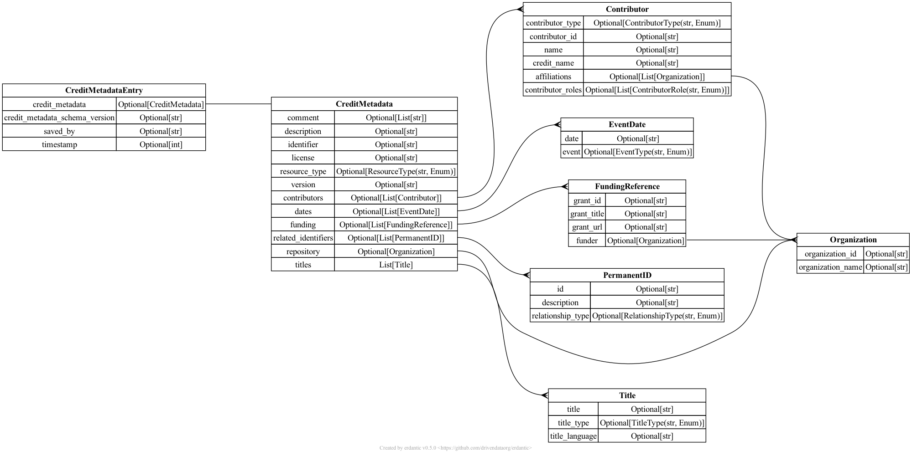

[](https://codecov.io/gh/kbase/credit_engine)
[](https://www.codacy.com/gh/kbase/credit_engine/dashboard?utm_source=github.com&amp;utm_medium=referral&amp;utm_content=kbase/credit_engine&amp;utm_campaign=Badge_Grade)

# KBase Credit Engine

This repo holds the schema and associated scripts used by the KBase Credit Engine.

- [KBase Credit Engine](#kbase-credit-engine)
  - [Installation](#installation)
  - [Metadata Schema](#metadata-schema)
    - [Schema Diagram](#schema-diagram)
    - [Useful commands](#useful-commands)

## Installation

This repo uses [poetry](https://python-poetry.org/) to manage the python environment and dependencies.

See the [poetry docs](https://python-poetry.org/docs/) for poetry installation instructions.

Install the project dependencies and create a virtual environment:

```sh
poetry install
```

Activate the virtual environment:

```sh
poetry shell
```

Run tests or other scripts:

```sh
poetry run <command>
poetry run pytest tests/
```

## Metadata Schema

The metadata schema is maintained in [linkml format](https://linkml.io); other formats (including the python class) can be generated from the [linkml schema file](schema/kbase/linkml/metadata.yaml).

See the [linkml documentation](https://linkml.io/linkml/index.html) for full details on using the linkml format and the related tools.

### Schema Diagram

Generated using [erdantic](https://erdantic.drivendata.org/stable/)



### Useful commands

These assume that you have already run `poetry shell` to activate the credit engine virtual environment.

generate derived files in all formats:
```sh
gen-project -d schema/ schema/kbase/linkml/metadata.yaml
```

lint the KBase linkml schema file:
```sh
linkml-lint -f terminal schema/kbase/linkml/metadata.yaml
```

validate data (in file `data.yaml`) against the schema:
```sh
linkml-validate -s schema/kbase/linkml/metadata.yaml data.yaml
```

generate Python models:
```sh
gen-python schema/kbase/linkml/metadata.yaml > src/metadata.py
```

generate a schema diagram (can be visualised at yuml.me):
```sh
gen-yuml schema/kbase/linkml/metadata.yaml
```
